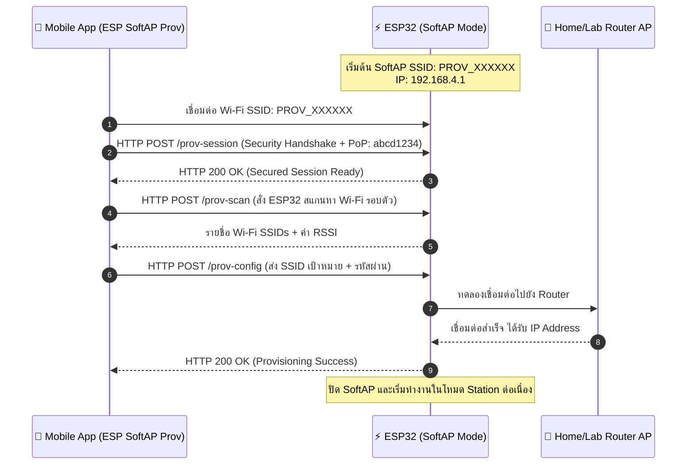
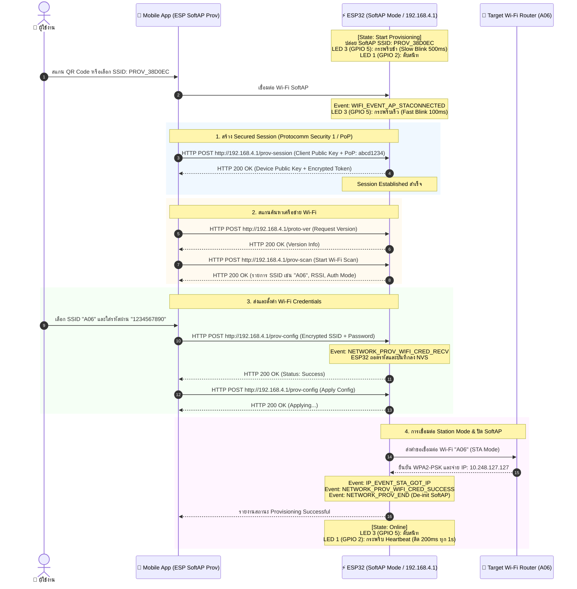

# ใบงานที่ 7.2 การคอนฟิก Wi-Fi ผ่าน SoftAP Scheme และการวิเคราะห์ Protocomm Endpoints

## 0. กล่าวนำ (Introduction)
ในใบงานนี้ นักศึกษาจะได้ทดลองตั้งค่าเครือข่าย Wi-Fi ให้กับ ESP32 ผ่านช่องทาง **Wi-Fi SoftAP Scheme (`wifi_prov_scheme_softap`)** โดยใช้สมาร์ตโฟนเชื่อมต่อเข้ากับเครือข่ายจำลองที่ ESP32 สร้างขึ้น 

นักศึกษาจะได้เรียนรู้โครงสร้างของ QR Code Payload, การทำงานของ Protocomm ผ่านโปรโตคอล HTTP REST-like Endpoints (`/prov-session`, `/prov-config`), และการส่งข้อมูลการตั้งค่า Wi-Fi จากแอปพลิเคชันมือถือ **ESP SoftAP Provisioning**

---

## 1. วัตถุประสงค์ (Objectives)
1. สามารถคอนฟิกตัวอย่าง `wifi_prov_mgr` ให้ทำงานในโหมด **SoftAP Transport Scheme**
2. สามารถใช้สมาร์ตโฟนเชื่อมต่อและทำ Provisioning ผ่านแอปพลิเคชัน **ESP SoftAP Provisioning** (หรือผ่าน Web Browser QR Code) ได้สำเร็จ
3. สังเกตและวิเคราะห์ Event Sequence Lifecycle ใน Serial Monitor ระหว่างการทำ SoftAP Provisioning
4. เข้าใจการทำงานของ Protocomm Endpoint ในระดับ Application Layer

---

## 2. อุปกรณ์และซอฟต์แวร์ที่ใช้ในการทดลอง
1. บอร์ดไมโครคอนโทรลเลอร์ ESP32 พร้อมสาย USB
2. สมาร์ตโฟน (Android หรือ iOS) ที่ติดตั้งแอปพลิเคชัน **ESP SoftAP Provisioning** (หรือแอปกล้องสแกน QR Code)
3. Wi-Fi Access Point ภายในห้องเรียนหรือ Hotspot จากสมาร์ตโฟนอีกเครื่อง

---

## 3. สถาปัตยกรรมและแผนภาพลำดับเหตุการณ์ (Sequence Diagram)



---

## 4. ขั้นตอนการทดลอง (Step-by-Step Procedures)

### ขั้นตอนที่ 1: การเปิดโปรเจกต์ Lab 7-2
1. เปิด Terminal ในโฟลเดอร์โปรเจกต์ `Week-07-W-iFi-Privisioning/Example_codes/Lab7-2-SoftAP-Provisioning`
2. โค้ดในโปรเจกต์นี้ได้รับการตั้งค่าเป็น **SoftAP Scheme** และ **Security 1 (PoP: `abcd1234`)** ไว้ล่วงหน้าเรียบร้อยแล้ว

---

### ขั้นตอนที่ 2: การ Flash และสังเกต QR Code
1. สั่งล้าง Flash และ Flash โปรแกรม:
   ```powershell
   idf.py -p COM24 erase-flash flash monitor
   ```
2. สังเกต Log ใน Serial Monitor จะปรากฏข้อความและ QR Code:
   ```text
   I (776) wifi_prov_scheme_softap: Starting SoftAP with SSID: PROV_XXXXXX
   I (786) app: Scan this QR code from the provisioning application for Provisioning.
   ... [รูป QR Code แบบ ASCII Text] ...
   I (816) app: If QR code is not visible, copy paste the below URL in a browser.
   https://espressif.github.io/esp-jumpstart/qrcode.html?data={"ver":"v1","name":"PROV_XXXXXX","pop":"abcd1234","transport":"softap"}
   ```

---

### ขั้นตอนที่ 3 ดำเนินการ Provisioning ผ่านสมาร์ตโฟน
1. เปิดแอป **ESP SoftAP Provisioning** บนสมาร์ตโฟน
2. **วิธีที่ A (สแกน QR Code)** แตะปุ่ม "Scan QR Code" แล้วสแกนภาพ QR Code บนหน้าจอ Serial Monitor (หรือเปิดผ่าน URL ที่ได้จาก Log)
3. **วิธีที่ B (เชื่อมต่อ Manual)**
   - ไปที่การตั้งค่า Wi-Fi บนมือถือ เชื่อมต่อ Wi-Fi ชื่อ `PROV_XXXXXX`
   - เปิดแอป กด "Provision" และป้อน PoP เป็น `abcd1234`
4. เมื่อแอปค้นหา ESP32 พบ ให้เลือกชื่อ Wi-Fi ภายในห้องเรียนหรือ Hotspot ที่ต้องการเชื่อมต่อ และป้อนรหัสผ่าน Wi-Fi
5. กดปุ่ม **Provision** และสังเกตแถบสถานะบนแอปจนกระทั่งขึ้น **"Provisioning Successful!"**

---

### ขั้นตอนที่ 4: สังเกตและบันทึก Log ใน Serial Monitor
สังเกตลำดับเหตุการณ์ (Events) ที่เกิดขึ้นบน ESP32 ตั้งแต่ SoftAP Started, Mobile Connected, DHCP Assigned IP (192.168.4.2), Protocomm Security 1 Handshake, Credentials Received, เชื่อมต่อไปยัง Target Wi-Fi (A06), ได้รับ IP (10.248.127.127), จนถึง SoftAP De-initialized อย่างสมบูรณ์:


---

---

## 5. กิจกรรมถอดรหัสซอร์สโค้ดและเขียนผังงาน (Code Deconstruction & Sequence Flow Assignment)

ให้นักศึกษาแกะรอยการทำงานจาก `main/main.c` ในโหมด SoftAP แล้วเขียน **แผนภาพลำดับเหตุการณ์ (Sequence Diagram)**:

### ภารกิจที่ 1: ผังลำดับการสื่อสารผ่าน HTTP Endpoints (SoftAP Scheme Sequence Flow)
ให้นักศึกษาวาด Sequence Diagram แสดงปฏิสัมพันธ์ระหว่าง 3 ฝ่าย:
1. **Smartphone App (ESP SoftAP Prov)**
2. **ESP32 SoftAP Webserver (Protocomm Layer)**
3. **Wi-Fi Router (AP ปลายทาง)**



---

## 6. ตารางบันทึกผลการทดลอง (Experiment Results)

| รายการตรวจสอบ | ค่าที่บันทึกได้จากการทดลอง |
| :--- | :--- |
| **1. ชื่อ SoftAP SSID ของ ESP32** | `PROV_38D0EC` |
| **2. รหัส PoP (Proof of Possession)** | `abcd1234` |
| **3. ข้อความใน QR Code Payload (JSON)** | `{"ver":"v1","name":"PROV_38D0EC","pop":"abcd1234","transport":"softap"}` |
| **4. พฤติกรรมไฟ LED 3 (GPIO 5) ช่วงรอ vs ช่วงส่งข้อมูล** | ช่วงรอ: กระพริบช้า (ติด 500ms / ดับ 500ms)<br/>ช่วงส่งข้อมูล: กระพริบเร็ว (ติด 100ms / ดับ 100ms)<br/>หลังสำเร็จ: ดับสนิท |
| **5. IP Address ที่ ESP32 ได้รับจาก Router** | `10.248.127.127` (Gateway: `10.248.127.29`) |
| **6. เวลาที่ใช้ตั้งแต่เริ่มจนจบกระบวนการ (วินาที)** | ประมาณ 2.5 - 3.5 วินาที |

---

## 7. คำถามท้ายการทดลอง (Post-Lab Questions)

1. **ในโหมด SoftAP Scheme สมาร์ตโฟนส่งข้อมูลหา ESP32 ผ่านโปรโตคอลและ IP Address ใด?**
   * **คำตอบ:** สมาร์ตโฟนส่งข้อมูลผ่านโปรโตคอล **HTTP REST (HTTP POST Request)** โดยส่ง Protocomm Payload (เข้ารหัสด้วย Protobuf + AES-CTR ใน Security 1) ไปยัง Default Gateway IP Address ของ ESP32 SoftAP ซึ่งคือ **`192.168.4.1`** (พอร์ตมาตรฐาน 80) ผ่าน Endpoint ต่างๆ เช่น `/prov-session` (สร้างเซสชัน), `/prov-scan` (สแกน Wi-Fi) และ `/prov-config` (ส่ง credentials)

2. **หากผู้ใช้ป้อนรหัสผ่าน Wi-Fi ผิดในแอปมือถือ จะเกิด Event ใดขึ้นบน ESP32 (`WIFI_PROV_CRED_FAIL` หรือไม่) และ ESP32 มีพฤติกรรมอย่างไร?**
   * **คำตอบ:** บน ESP32 จะเกิด Event **`NETWORK_PROV_WIFI_CRED_FAIL`** (หรือ `WIFI_PROV_CRED_FAIL`) ควบคู่กับ `WIFI_EVENT_STA_DISCONNECTED` (สาเหตุ 4-way Handshake Timeout หรือ Auth Fail) โดยพฤติกรรมของ ESP32 คือ **จะยังไม่ปิดโหมด SoftAP** และไม่ล้างเซสชันทิ้ง แต่จะส่งสถานะ Error Response (HTTP Status) กลับไปยังแอปพลิเคชันบนมือถือ เพื่อเปิดโอกาสให้ผู้ใช้งานกรอกรหัสผ่าน Wi-Fi ใหม่อีกครั้งได้ทันที โดยไม่ต้องเริ่มต้นเชื่อมต่อ SoftAP ใหม่อีกรอบ

3. **ทำไมผู้ผลิต IoT ส่วนใหญ่จึงมองว่ากระบวนการเชื่อมต่อแบบ SoftAP มีขั้นตอนที่ยุ่งยากสำหรับผู้ใช้ทั่วไปเมื่อเทียบกับ BLE?**
   * **คำตอบ:**
     1. **ขั้นตอนการสลับเครือข่าย Wi-Fi (Manual Wi-Fi Switching):** ระบบปฏิบัติการมือถือ (โดยเฉพาะ iOS) มักไม่อนุญาตให้แอปสลับ Wi-Fi โดยอัตโนมัติ ผู้ใช้ต้องออกจากแอปเพื่อเข้าไปที่ Settings $\rightarrow$ Wi-Fi $\rightarrow$ เชื่อมต่อ `PROV_XXXXXX` แล้วจึงสลับกลับมาที่แอป
     2. **ปัญหา "No Internet Access" Pop-up / Captive Portal:** เนื่องจากเครือข่าย SoftAP ของ ESP32 ไม่มีอินเทอร์เน็ต โทรศัพท์อาจตัดกลับไปใช้ Cellular Data (4G/5G) อัตโนมัติ หรือขึ้นแจ้งเตือน Captive Portal ทำให้การส่ง HTTP POST ล้มเหลว
     3. **ความสะดวกรวดเร็วของ BLE (Bluetooth Low Energy):** โหมด BLE สามารถสแกน ค้นหา จับคู่ และแลกเปลี่ยนข้อมูลการตั้งค่าผ่าน Bluetooth GATT ได้ทันทีจากภายในแอป โดยที่โทรศัพท์ของผู้ใช้ยังคงเชื่อมต่ออินเทอร์เน็ตและ Wi-Fi ได้ต่อเนื่องราบรื่น (Seamless UX)

