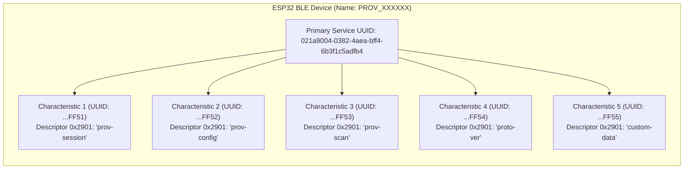
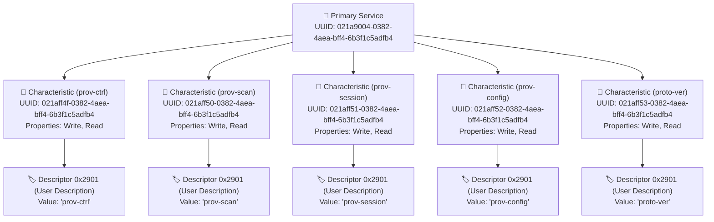
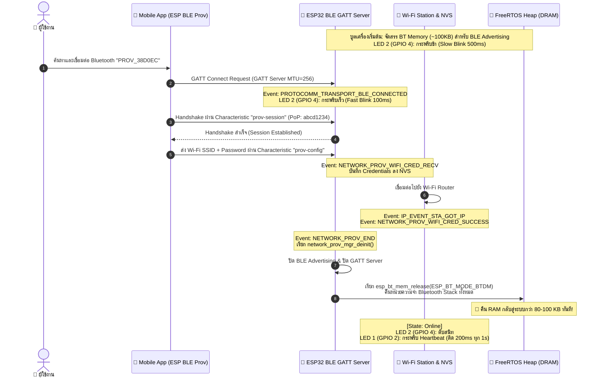

# ใบงานที่ 7.3 การคอนฟิก Wi-Fi ผ่าน BLE Scheme และการสืบสวน GATT Services (BLE Forensics)

## 0. กล่าวนำ (Introduction)
**Bluetooth Low Energy (BLE) Provisioning** เป็นรูปแบบมาตรฐานสากลที่อุปกรณ์ Smart Home ชั้นนำ (เช่น Apple HomeKit, Google Home, Matter Protocol) เลือกใช้ เนื่องจากผู้ใช้ไม่ต้องสลับการเชื่อมต่อ Wi-Fi บนสมาร์ตโฟน 

ในใบงานนี้ นักศึกษาจะได้สลับ ESP32 มาทำงานในโหมด **BLE Scheme (`wifi_prov_scheme_ble`)** พร้อมทั้งใช้เครื่องมือวิเคราะห์เชิงลึก **nRF Connect for Mobile** เพื่อส่องดูโครงสร้างภายในของ **GATT Primary Services, 128-bit UUIDs, Characteristics และ Descriptors** ก่อนจะทำการ Provisioning ผ่านแอป **ESP BLE Provisioning**

---

## 1. วัตถุประสงค์ (Objectives)
1. สามารถคอนฟิกตัวอย่าง `wifi_prov_mgr` ให้ทำงานในโหมด **BLE Transport Scheme** ได้สำเร็จ
2. สามารถใช้เครื่องมือ **nRF Connect for Mobile** ในการสแกนและตรวจสอบโครงสร้าง GATT Services/Characteristics ของ Protocomm บน ESP32
3. อ่านและวิเคราะห์ Descriptor `0x2901` (User Characteristic Description) เพื่อระบุชื่อ Protocomm Endpoints
4. ดำเนินการ Provisioning ผ่านแอปพลิเคชัน **ESP BLE Provisioning** และสังเกตการคืนหน่วยความจำ Bluetooth RAM (`BTDM memory released`)

---

## 2. อุปกรณ์และซอฟต์แวร์ที่ใช้ในการทดลอง
1. บอร์ดไมโครคอนโทรลเลอร์ ESP32 พร้อมสาย USB
2. สมาร์ตโฟนที่รองรับ BLE และติดตั้งแอปพลิเคชัน:
   - **nRF Connect for Mobile** (โดย Nordic Semiconductor)
   - **ESP BLE Provisioning** (โดย Espressif)
3. Wi-Fi Access Point ภายในห้องเรียนหรือ Hotspot

---

## 3. สถาปัตยกรรม GATT Services & Endpoints บน BLE Scheme



---

## 4. ขั้นตอนการทดลอง (Step-by-Step Procedures)

### ขั้นตอนที่ 1: การเปิดโปรเจกต์ Lab 7-3
1. เปิด Terminal ในโฟลเดอร์โปรเจกต์ `Week-07-W-iFi-Privisioning/Example_codes/Lab7-3-BLE-Provisioning`
2. โค้ดในโปรเจกต์นี้ได้รับการตั้งค่าเปิดใช้งาน **BLE Scheme (NimBLE)** และ **Security 1 (PoP: `abcd1234`)** ไว้เรียบร้อยแล้ว

---

### ขั้นตอนที่ 2: Build, Flash และตรวจสอบสถานะเริ่มต้น
1. สั่งล้าง Flash และ Flash โปรแกรมใหม่:
   ```powershell
   idf.py -p COM24 erase-flash flash monitor
   ```
2. สังเกต Log ใน Serial Monitor:
   ```text
   I (712) wifi_prov_scheme_ble: Starting BLE provisioning
   I (722) app: Starting provisioning
   I (732) app: Scan this QR code from the provisioning application for Provisioning.
   ... [QR Code ASCII & URL] ...
   ```

---

### ขั้นตอนที่ 3: ส่องโครงสร้าง GATT ผ่านแอป nRF Connect (BLE Forensic)
1. เปิดแอป **nRF Connect for Mobile** บนสมาร์ตโฟน
2. แตะปุ่ม **Scan** เพื่อค้นหาอุปกรณ์บลูทูธรอบตัว
3. ค้นหาชื่ออุปกรณ์ที่ขึ้นต้นด้วย `PROV_XXXXXX` (ตรงกับที่ระบุใน Serial Monitor)
4. สังเกตค่า RSSI และแตะปุ่ม **CONNECT** เพื่อเชื่อมต่อ
5. เมื่อเชื่อมต่อสำเร็จ สำรวจดู **GATT Services**:
   - มองหา **Unknown Service** ที่มี Base UUID `021a9004-0382-4aea-bff4-6b3f1c5adfb4`
   - ขยายดูรายการ Characteristics แต่ละตัว
   - สังเกตว่าในแต่ละ Characteristic จะมี Descriptor `Characteristic User Description` (`UUID 0x2901`) แตะดูค่า จะพบชื่อ Endpoint เช่น `"prov-session"`, `"prov-config"`, `"custom-data"`
6. บันทึกภาพหน้าจอและข้อมูล UUIDs ลงในตารางผลการทดลอง
7. กดปุ่ม **DISCONNECT** บนแอป nRF Connect เพื่อปล่อยบอร์ดให้พร้อมรับการ Provision

```text
I (1098) LAB7_3_BLE: --------------------------------------------------
I (1108) LAB7_3_BLE: [QR CODE URL]: Click or copy URL to scan QR Code:
I (1118) LAB7_3_BLE: https://espressif.github.io/esp-jumpstart/qrcode.html?data=%7B%22ver%22%3A%22v1%22%2C%22name%22%3A%22PROV_38D0EC%22%2C%22pop%22%3A%22abcd1234%22%2C%22transport%22%3A%22ble%22%7D
I (1128) LAB7_3_BLE: Payload JSON: {"ver":"v1","name":"PROV_38D0EC","pop":"abcd1234","transport":"ble"}
I (1138) LAB7_3_BLE: --------------------------------------------------
I (1148) NimBLE: GAP procedure initiated: advertise; 
I (1148) NimBLE: disc_mode=2
I (1148) NimBLE:  adv_channel_map=0 own_addr_type=0 adv_filter_policy=0 adv_itvl_min=256 adv_itvl_max=256
I (1158) NimBLE: 

I (34288) LAB7_3_BLE: [BLE]: Smartphone Connected to GATT Server!
I (34408) protocomm_nimble: mtu update event; conn_handle=0 cid=4 mtu=256
W (77128) LAB7_3_BLE: [BLE]: Smartphone Disconnected from GATT Server
```


---

### ขั้นตอนที่ 4: ทำการ Provisioning ด้วยแอป ESP BLE Provisioning
1. เปิดแอป **ESP BLE Provisioning**
2. เลือก "Provision New Device" $\rightarrow$ เลือก "BLE"
3. แตะชื่อบอร์ด `PROV_XXXXXX` (หรือสแกน QR Code)
4. ป้อน PoP เป็น `abcd1234`
5. เลือกเครือข่าย Wi-Fi ในห้องเรียน และป้อนรหัสผ่าน Wi-Fi
6. กด **Provision** และรอจนกระทั่งเชื่อมต่อสำเร็จ

---

### ขั้นตอนที่ 5: สังเกตการปล่อยหน่วยความจำ Bluetooth (Memory Freeing)
สังเกตใน Serial Monitor หลังเชื่อมต่อ Wi-Fi สำเร็จ:

```text
I (375458) LAB7_3_BLE: [BLE CREDENTIALS RECEIVED]:
I (375458) LAB7_3_BLE:   -> Target SSID     : A06
I (375458) LAB7_3_BLE:   -> Target Password : 1234567890
I (381638) wifi:connected with A06, aid = 1, channel 6, BW20, bssid = 0e:2c:c3:c8:7c:6d
I (382708) LAB7_3_BLE: =================================================
I (382708) LAB7_3_BLE: [ONLINE]: Connected to Wi-Fi with IP: 10.248.127.127
I (382708) LAB7_3_BLE: =================================================
I (382728) LAB7_3_BLE: [SUCCESS]: BLE Provisioning Successful!
I (386838) network_prov_mgr: Provisioning stopped
I (386838) LAB7_3_BLE: [PROV EVENT]: De-initializing BLE & Releasing BT Memory...
I (386838) network_prov_scheme_ble: BTDM memory released
```

> **ข้อสังเกต:** บอร์ดจะทำการล้างและคืนหน่วยความจำของ Bluetooth Controller (`BTDM memory released`) ทั้งหมดคืนสู่ระบบ DRAM ทันที ทำให้ประหยัด RAM ได้กว่า 80-100 KB!


---

---

## 5. กิจกรรมถอดรหัสซอร์สโค้ดและเขียนผังงาน (Code Deconstruction & BLE GATT Architecture Assignment)

ให้นักศึกษาแกะรอยการทำงานของโมดูล BLE Provisioning ใน `main/main.c` แล้วเขียน **ผังโครงสร้างและลำดับเหตุการณ์**:

### ภารกิจที่ 1: ผังโครงสร้าง GATT Tree & Endpoint Mapping
โครงสร้างต้นไม้ (GATT Tree Structure) แสดงความสัมพันธ์ระหว่าง Primary Service, Characteristics และ Descriptors (`0x2901`):



---

### ภารกิจที่ 2: ผังลำดับการคืนหน่วยความจำ Bluetooth (BLE Lifecycle & Memory Reclaim Flow)



---

## 6. ตารางบันทึกผลการทดลอง (Experiment Results)

| รายการตรวจสอบ | ผลการทดลอง / ข้อมูลที่สังเกตได้ |
| :--- | :--- |
| **1. BLE Device Name ที่สแกนเจอ** | `PROV_38D0EC` (Bluetooth MAC: `84:1f:e8:38:d0:ee`) |
| **2. Primary Service UUID (128-bit)** | `021a9004-0382-4aea-bff4-6b3f1c5adfb4` |
| **3. Characteristic Endpoints ที่พบ (Descriptor 0x2901)** | 1. `021aff4f-...` $\rightarrow$ **`prov-ctrl`**<br/>2. `021aff50-...` $\rightarrow$ **`prov-scan`**<br/>3. `021aff51-...` $\rightarrow$ **`prov-session`**<br/>4. `021aff52-...` $\rightarrow$ **`prov-config`**<br/>5. `021aff53-...` $\rightarrow$ **`proto-ver`** |
| **4. พฤติกรรมไฟ LED 2 (GPIO 4) ช่วงรอ vs ช่วงต่อ BLE** | ช่วงรอ Advertising: กระพริบช้า (ติด 500ms / ดับ 500ms)<br/>ช่วงต่อ BLE Connected: กระพริบเร็ว (ติด 100ms / ดับ 100ms)<br/>หลังต่อ Wi-Fi สำเร็จ: ดับสนิท (OFF) |
| **5. พฤติกรรมเมื่อต่อ Wi-Fi สำเร็จ** | **มี** ข้อความใน Log: `network_prov_scheme_ble: BT memory released` เพื่อคืนหน่วยความจำ Bluetooth Controller กลับสู่ Heap DRAM |

---

## 7. คำถามท้ายการทดลอง (Post-Lab Questions)

1. **เหตุใด BLE Provisioning จึงไม่ส่งผลให้สัญญาณ Wi-Fi บนสมาร์ตโฟนของผู้ใช้หลุดระหว่างทำรายการ?**
   * **คำตอบ:** เพราะ BLE (Bluetooth Low Energy) ทำงานอยู่บนคลื่นความถี่วิทยุและโปรโตคอลสแต็กคนละส่วนกับ Wi-Fi Interface ของสมาร์ตโฟน โทรศัพท์จึงสามารถสื่อสารรับส่งข้อมูลกับ ESP32 ผ่านบลูทูธได้โดยตรง โดยที่โมเด็ม Wi-Fi และ Cellular Data (4G/5G) ของสมาร์ตโฟนยังคงเชื่อมต่ออินเทอร์เน็ตได้ตามปกติ ไม่จำเป็นต้องตัดการเชื่อมต่อ Wi-Fi ไปเกาะ SoftAP เหมือนใน Lab 7.2

2. **Descriptor `0x2901` มีความสำคัญอย่างไรต่อการที่แอปพลิเคชันมือถือจะทราบว่า Characteristic แต่ละตัวใช้ทำหน้าที่อะไร?**
   * **คำตอบ:** Descriptor **`0x2901` (Characteristic User Description)** ทำหน้าที่เป็นป้ายกำกับข้อความ (Human-readable String / Name Identifier) ให้กับแต่ละ Characteristic เนื่องจาก 128-bit UUID ของ Characteristic เป็นชุดตัวเลขรหัสฐานสิบหกที่แอปพลิเคชันภายนอกไม่ทราบล่วงหน้าว่าท่อใดใช้สำหรับอะไร เมื่อแอปพลิเคชันมือถือเชื่อมต่อเข้ามา จึงอ่านค่าจาก Descriptor `0x2901` เพื่อระบุและ Map ท่อรับส่งข้อมูลเข้ากับ Protocomm Endpoints ที่ต้องการ เช่น `"prov-session"` สำหรับ Handshake, `"prov-config"` สำหรับส่งรหัสผ่าน Wi-Fi ได้อย่างถูกต้องและยืดหยุ่น

3. **การที่ ESP-IDF มีฟังก์ชัน `esp_bt_mem_release()` มีประโยชน์อย่างไรต่อการทำงานของแอปพลิเคชัน IoT หลังเชื่อมต่อ Wi-Fi สำเร็จ?**
   * **คำตอบ:** Bluetooth Protocol Stack (โดยเฉพาะ Bluetooth Controller และ Host) มีขนาดใหญ่และต้องใช้พื้นที่แรมภายในชิป (SRAM/DRAM) ปริมาณมาก (ประมาณ 80 - 100 KB) ซึ่งหลังจากขั้นตอน Provisioning เสร็จสิ้น อุปกรณ์ IoT ส่วนใหญ่จะทำงานผ่าน Wi-Fi เพียงอย่างเดียว การเรียก `esp_bt_mem_release(ESP_BT_MODE_BTDM)` จึงเป็นการปิดการทำงานของระบบวิทยุบลูทูธและคืนพื้นที่หน่วยความจำทั้งหมดกลับเข้าสู่ FreeRTOS Heap DRAM ทำให้เฟิร์มแวร์มีแรมคงเหลือสำหรับ Application, MQTT, TLS/SSL Buffer, และ Web Server เพิ่มขึ้นอย่างมหาศาล ป้องกันปัญหา Out of Memory (OOM)

