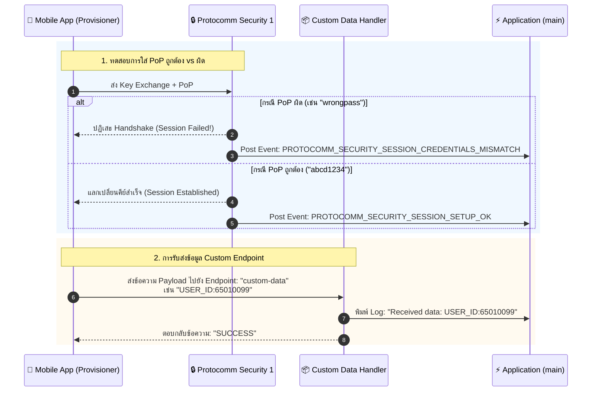
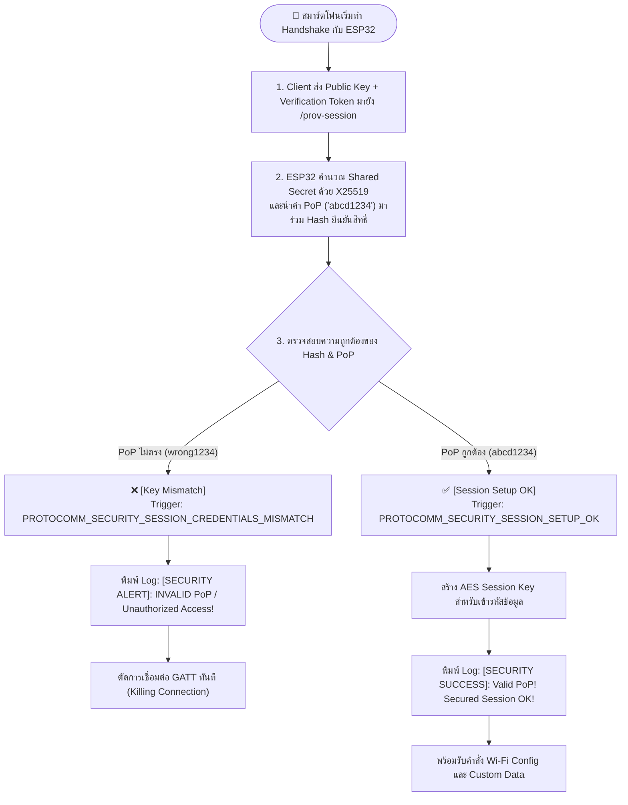
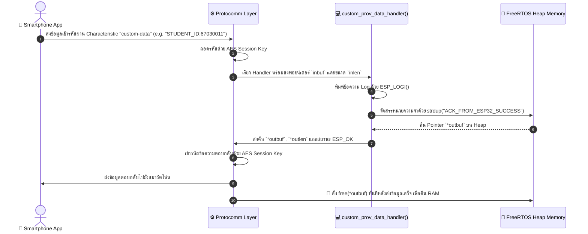

# ใบงานที่ 7.4: การทดสอบ Security Schemes (PoP) และการรับส่ง Custom Data Endpoints

## 0. กล่าวนำ (Introduction)
ในใบงานนี้ นักศึกษาจะได้ทดสอบเจาะลึกด้านความปลอดภัยของกระบวนการ Provisioning โดยทำการทดลองจำลองสถานการณ์ที่มีผู้ไม่หวังดีพยายามเชื่อมต่อด้วย **รหัส Proof-of-Possession (PoP) ที่ไม่ถูกต้อง** เพื่อสังเกตกลไกการปฏิเสธการเชื่อมต่อของ Protocomm Security Layer

นอกจากนี้ นักศึกษาจะได้เรียนรู้การเพิ่ม **Custom Data Endpoint (`custom-data`)** เพื่อรับส่งข้อมูลเฉพาะของแอปพลิเคชัน (เช่น Device ID, Owner Email, MQTT Broker URL หรือ Activation Code) ระหว่างมือถือและ ESP32 ในระหว่างขั้นตอน Provisioning

---

## 1. วัตถุประสงค์ (Objectives)
1. เข้าใจบทบาทและการทำงานของ **Proof-of-Possession (PoP)** ในการป้องกันการโจมตีแบบสวมรอย (Rogue Provisioning)
2. ทดลองจำลองกรณีป้อน PoP ผิด และสังเกต Event `PROTOCOMM_SECURITY_SESSION_CREDENTIALS_MISMATCH`
3. เข้าใจการลงทะเบียน Custom Endpoint ด้วย `wifi_prov_mgr_endpoint_create()` และ `wifi_prov_mgr_endpoint_register()`
4. สังเกตและวิเคราะห์การรับส่งข้อมูลผ่าน Custom Handler (`custom_prov_data_handler`)

---

## 2. อุปกรณ์และซอฟต์แวร์ที่ใช้ในการทดลอง
1. บอร์ดไมโครคอนโทรลเลอร์ ESP32 พร้อมสาย USB
2. สมาร์ตโฟนที่ติดตั้งแอปพลิเคชัน **ESP BLE Provisioning** หรือ **ESP SoftAP Provisioning**
3. Serial Monitor Tool

---

## 3. สถาปัตยกรรม Custom Endpoint & PoP Security Handshake



---

## 4. โค้ดส่วน Custom Data Handler ในตัวอย่าง `main.c`

พิจารณาการทำงานของฟังก์ชันจัดการข้อมูล Custom Endpoint:

```c
/* Handler สำหรับ Custom Endpoint ที่แอปพลิเคชันลงทะเบียนไว้ */
esp_err_t custom_prov_data_handler(uint32_t session_id, const uint8_t *inbuf, ssize_t inlen,
                                   uint8_t **outbuf, ssize_t *outlen, void *priv_data)
{
    if (inbuf) {
        ESP_LOGI(TAG, "Received custom data: %.*s", (int)inlen, (char *)inbuf);
    }
    
    // จัดเตรียมข้อความตอบกลับไปยังสมาร์ตโฟน
    char response[] = "ACK_FROM_ESP32";
    *outbuf = (uint8_t *)strdup(response);
    if (*outbuf == NULL) {
        ESP_LOGE(TAG, "System out of memory");
        return ESP_ERR_NO_MEM;
    }
    *outlen = strlen(response) + 1;

    return ESP_OK;
}
```

และขั้นตอนการลงทะเบียนใน `app_main()`:
```c
// 1. สร้าง Endpoint ก่อนเริ่ม Provisioning Service
wifi_prov_mgr_endpoint_create("custom-data");

// 2. เริ่มต้น Service
ESP_ERROR_CHECK(wifi_prov_mgr_start_provisioning(security, (const void *) sec_params, service_name, service_key));

// 3. ผูกฟังก์ชัน Callback เข้ากับ Endpoint หลังเริ่ม Service แล้ว
wifi_prov_mgr_endpoint_register("custom-data", custom_prov_data_handler, NULL);
```

---

## 5. ขั้นตอนการทดลอง (Step-by-Step Procedures)

### ตอนที่ 1: การเปิดโปรเจกต์และทดสอบ Security Handshake ด้วย PoP
1. เปิด Terminal ในโฟลเดอร์โปรเจกต์ `Week-07-W-iFi-Privisioning/hw-67030011/lab7-4`
2. สั่งล้าง Flash และรันโปรแกรม:
   ```powershell
   idf.py -p /dev/cu.usbserial-0001 erase-flash flash monitor
   ```
3. เปิดแอป **ESP BLE Provisioning** สแกนหาบอร์ด ESP32 (`PROV_38D0EC`)
4. **การทดสอบที่ 1 (ป้อน PoP ผิด):**
   - เมื่อแอปถามรหัส PoP ให้พิมพ์รหัสผ่านมั่ว เช่น `wrong1234`
   - สังเกตปฏิกิริยาบนแอปมือถือและใน Serial Monitor:
     ```text
     E (9589) security1: Key mismatch. Close connection
     E (9599) security1: Session setup error -1
     E (9599) protocomm_nimble: Invalid content received, killing connection
     E (9609) LAB7_4_SECURITY_CUSTOM: --------------------------------------------------
     E (9619) LAB7_4_SECURITY_CUSTOM: [SECURITY ALERT]: INVALID PoP / Unauthorized Access!
     E (9619) LAB7_4_SECURITY_CUSTOM: --------------------------------------------------
     W (9759) LAB7_4_SECURITY_CUSTOM: [BLE]: Smartphone Disconnected from GATT Server
     ```


5. **การทดสอบที่ 2 (ป้อน PoP ถูกต้อง):**
   - สั่งรีเซ็ตบอร์ดใหม่ และเปิดแอปป้อน PoP เป็น `abcd1234` (ตรงกับค่าในโค้ด)
   - สังเกต Log:
     ```text
     I (79149) LAB7_4_SECURITY_CUSTOM: [BLE]: Smartphone Connected to GATT Server!
     I (79269) protocomm_nimble: mtu update event; conn_handle=0 cid=4 mtu=256
     I (80499) LAB7_4_SECURITY_CUSTOM: --------------------------------------------------
     I (80499) LAB7_4_SECURITY_CUSTOM: [SECURITY SUCCESS]: Valid PoP! Secured Session OK!
     I (80509) LAB7_4_SECURITY_CUSTOM: --------------------------------------------------
     ```


---

### ตอนที่ 2: การรับส่งข้อมูลผ่าน Custom Endpoint
1. ในหน้าแอป **ESP BLE Provisioning** (หรือผ่านเครื่องมือทดสอบ) ส่งข้อมูลรหัสนักศึกษา `STUDENT_ID:67030011` ไปยัง Custom Endpoint `custom-data`
2. สังเกต Serial Monitor บน ESP32 จะปรากฏข้อความที่ได้รับจาก Client พร้อมทั้งส่งข้อความตอบกลับ `ACK_FROM_ESP32_SUCCESS`:

```text
I (9399) LAB7_4_SECURITY_CUSTOM: [BLE]: Smartphone Connected to GATT Server!
I (9519) protocomm_nimble: mtu update event; conn_handle=0 cid=4 mtu=256
I (10809) LAB7_4_SECURITY_CUSTOM: --------------------------------------------------
I (10809) LAB7_4_SECURITY_CUSTOM: [SECURITY SUCCESS]: Valid PoP! Secured Session OK!
I (10819) LAB7_4_SECURITY_CUSTOM: --------------------------------------------------
I (10959) LAB7_4_SECURITY_CUSTOM: =================================================
I (10959) LAB7_4_SECURITY_CUSTOM: [CUSTOM DATA RECEIVED]: STUDENT_ID:67030011
I (10959) LAB7_4_SECURITY_CUSTOM: =================================================
```


---

---

## 6. กิจกรรมถอดรหัสซอร์สโค้ดและเขียนผังงาน (Code Deconstruction & Security Flow Assignment)

ให้นักศึกษาแกะรอยการทำงานด้านความปลอดภัยและ Custom Handler ใน `main/main.c` แล้วเขียน **ผังการไหลของข้อมูล (Data Flow & Cryptographic Handshake Flow)**:

### ภารกิจที่ 1: ผังขั้นตอนการตรวจสอบ PoP (Security Handshake Decision Flow)



---

### ภารกิจที่ 2: ผังการรับส่งข้อมูลผ่าน Custom Endpoint (Custom Data Handler Flow)



> 📌 **ทำไมตัวแปร `*outbuf` จึงต้องจัดสรรใน Heap Memory?**  
> เพราะฟังก์ชัน `custom_prov_data_handler()` จะทำงานเสร็จและ Return ออกไปก่อนที่ Protocomm Layer จะนำข้อมูลใน `*outbuf` ไปเข้ารหัสและส่งผ่านวิทยุ Bluetooth จริง หากจัดสรรใน Local Stack Array (เช่น `char buf[32]`) พื้นที่หน่วยความจำนั้นจะถูกทำลาย (Stack Invalidation) ทันทีที่ฟังก์ชันจบการทำงาน ทำให้เกิดบั๊กส่งข้อมูลขยะหรือชิป Crash การใช้ `strdup()`/`malloc()` บน **Heap** จึงรับประกันว่าข้อมูลจะคงอยู่จนกว่า Protocomm จะส่งเสร็จและสั่ง `free()` ให้โดยอัตโนมัติ

---

## 7. ตารางบันทึกผลการทดลอง (Experiment Results)

| สถานการณ์ทดสอบ | ค่า PoP ที่ป้อน | ผลลัพธ์บนแอปมือถือ | ข้อความ Log ใน Serial Monitor |
| :--- | :--- | :--- | :--- |
| **1. ป้อน PoP ผิดพลาด** | `wrong1234` | หน้าจอแอปแสดงข้อความเตือน Error: Session establishment failed / Invalid PoP และไม่สามารถไปขั้นตอนต่อไปได้ | `E security1: Key mismatch. Close connection`<br/>`E [SECURITY ALERT]: INVALID PoP / Unauthorized Access!`<br/>`W [BLE]: Smartphone Disconnected from GATT Server` |
| **2. ป้อน PoP ถูกต้อง** | `abcd1234` | ผ่านขั้นตอนตรวจสอบสิทธิ์สำเร็จ แอปแสดงรายชื่อ Wi-Fi ให้เลือกและอนุญาตให้ส่งข้อมูล | `I [SECURITY SUCCESS]: Valid PoP! Secured Session OK!`<br/>`I [BLE CREDENTIALS RECEIVED]: SSID: A06, Password: ...`<br/>`I [SUCCESS]: Provisioning Completed Successfully!` |
| **3. ส่ง Custom Data** | `STUDENT_ID:67030011` | แอปได้รับข้อความตอบกลับ: `ACK_FROM_ESP32_SUCCESS` | `I [CUSTOM DATA RECEIVED]: STUDENT_ID:67030011`<br/>ESP32 สร้างคำตอบกลับบน Heap และส่งกลับไปยัง Client |

---

## 8. คำถามท้ายการทดลอง (Post-Lab Questions)

1. **การใช้ Proof-of-Possession (PoP) ช่วยป้องกันการโจมตีประเภทใดได้บ้าง?**
   * **คำตอบ:** ป้องกันการโจมตีประเภท **Rogue Provisioning (การถูกสวมรอยหรือยึดครองอุปกรณ์โดยบุคคลที่ไม่ได้รับอนุญาต)** และ **Man-in-the-Middle (MitM) Attack** เนื่องจากแม้ผู้โจมตีจะอยู่ในรัศมีสัญญาณบลูทูธและมองเห็นชื่ออุปกรณ์ แต่หากไม่มีรหัส PoP (ซึ่งมักพิมพ์อยู่บนสติกเกอร์ที่ตัวอุปกรณ์ หรือแสดงบนหน้าจอของอุปกรณ์โดยตรง เพื่อยืนยันว่าผู้ใช้ครอบครองอุปกรณ์อยู่จริง) ผู้โจมตีจะไม่สามารถผ่านขั้นตอน Cryptographic Handshake หรือส่งข้อมูล Wi-Fi มายึดอุปกรณ์ได้

2. **หากไม่มีการใช้ PoP (เช่น ใน Security 0) ผู้โจมตีที่อยู่ในรัศมีสัญญาณบลูทูธสามารถทำสิ่งใดกับอุปกรณ์ได้บ้าง?**
   * **คำตอบ:** ผู้ไม่หวังดีสามารถเชื่อมต่อเข้าสู่อุปกรณ์ได้ทันทีโดยไม่มีการพิสูจน์ตัวตน และสามารถ:
     1. ส่ง SSID และ Password ปลอมเพื่อให้ ESP32 เปลี่ยนไปเชื่อมต่อกับ Rogue Wi-Fi Hotspot ของผู้โจมตี
     2. ดักฟังและดักจับข้อมูลการตั้งค่าทั้งหมดที่ส่งผ่าน Plain-text
     3. ขโมยหรือยึดการควบคุมอุปกรณ์ IoT (Denial of Service หรือ Device Hijacking) ก่อนที่เจ้าของจริงจะได้ตั้งค่า

3. **ในการประยุกต์ใช้งานเชิงพาณิชย์จริง เราสามารถนำ Custom Data Endpoint ไปใช้ส่งข้อมูลประเภทใดได้อีกบ้าง (ยกตัวอย่าง 2 กรณี)?**
   * **คำตอบ:**
     * **กรณีที่ 1 (User Account & Device Binding):** ส่ง `User_Token` หรือ `Owner_Account_UUID` จากแอปมือถือไปยัง ESP32 เพื่อทำการผูกอุปกรณ์เข้ากับบัญชีผู้ใช้บน Cloud Platform ทันทีหลังจากต่อเน็ตสำเร็จ
     * **กรณีที่ 2 (Server & Environment Configuration):** ส่ง URL ของ `MQTT_Broker_Address`, `Tenant_ID`, หรือ `Organization_API_Key` เพื่อกำหนดเซิร์ฟเวอร์ปลายทางของโรงงานหรือองค์กรที่อุปกรณ์ต้องส่งข้อมูลเซนเซอร์ไปหา

4. **ในฟังก์ชัน `custom_prov_data_handler()` เหตุใดหน่วยความจำที่จัดสรรให้ `*outbuf` จึงถูก Free โดย Protocomm Layer อัตโนมัติหลังจากส่งข้อมูลเสร็จ?**
   * **คำตอบ:** เพื่อป้องกันปัญหา **Memory Leak (หน่วยความจำรั่วไหล)** เนื่องจากโมเดลการทำงานของ Protocomm ออกแบบให้ Handler ทำหน้าที่เพียงแค่ "สร้างและคืนพอยน์เตอร์ข้อมูล" (`*outbuf`) ส่วนกระบวนการนำข้อมูลไปเข้ารหัส แตกแพ็กเก็ต และส่งผ่านฮาร์ดแวร์วิทยุ (BLE GATT หรือ HTTP) เป็นงานของ Protocomm Layer ซึ่งทำงานแบบ Asynchronous ดังนั้น Protocomm จึงรับผิดชอบในการเรียก `free(*outbuf)` ทันทีที่แพ็กเก็ตสุดท้ายถูกส่งออกไปอย่างสมบูรณ์ เพื่อคืน DRAM ให้ระบบอย่างปลอดภัย

