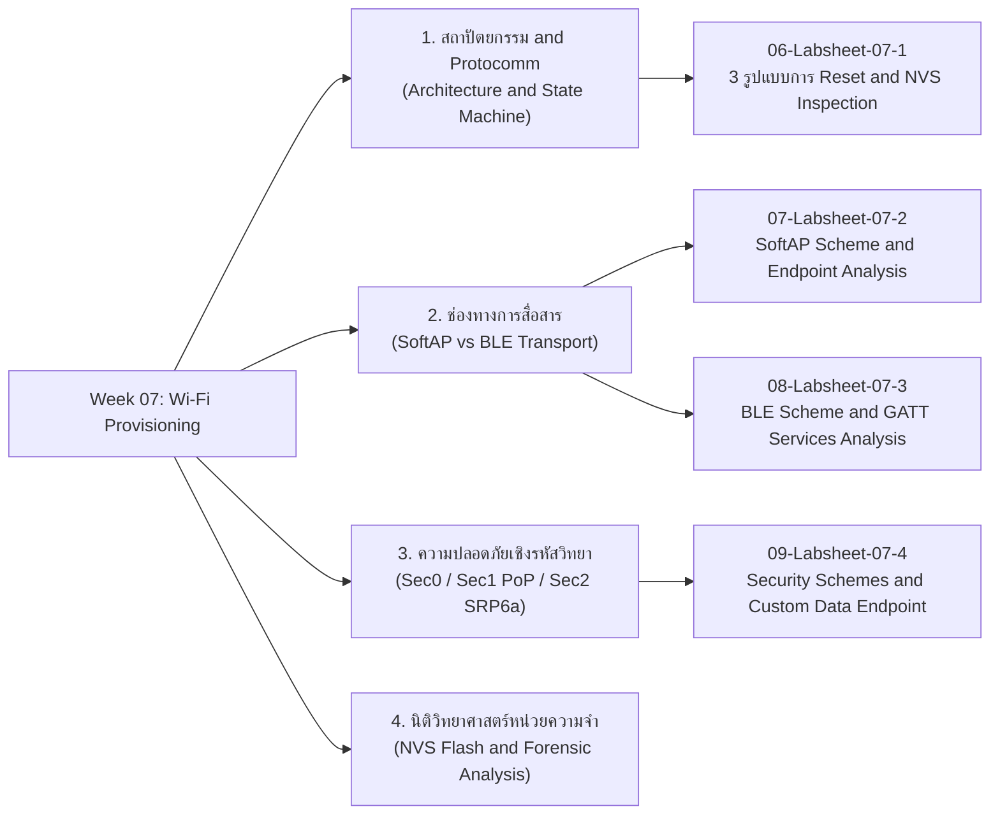
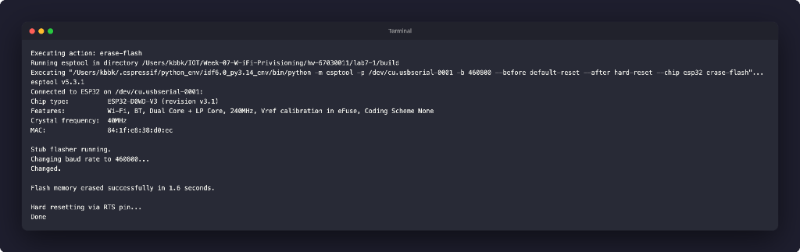
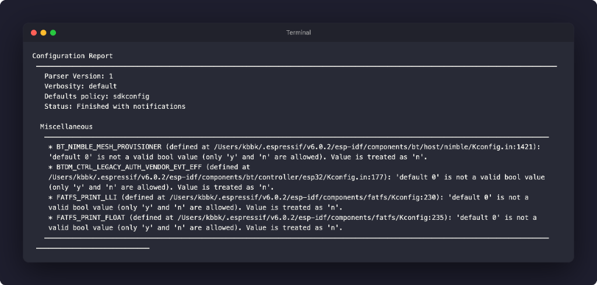
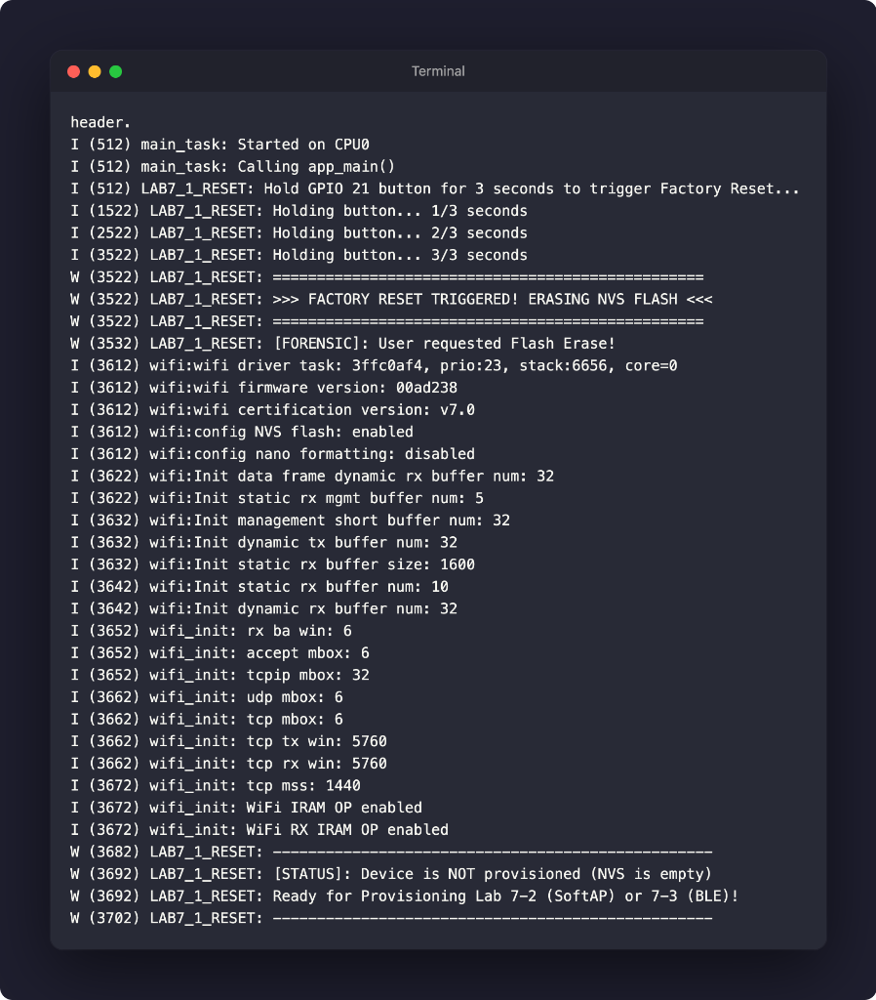
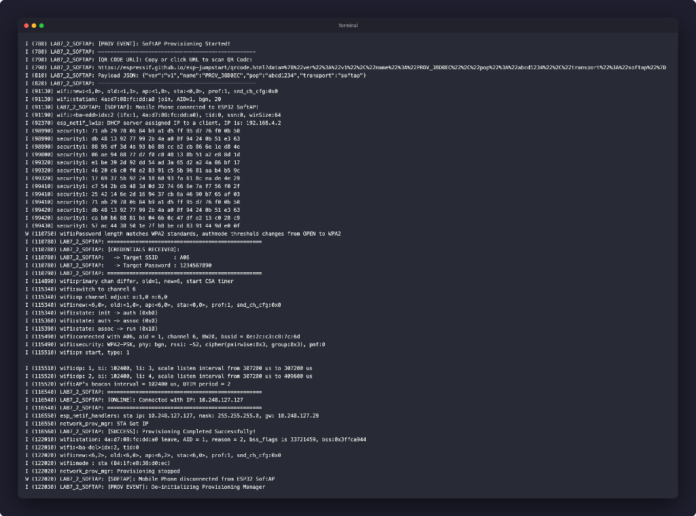
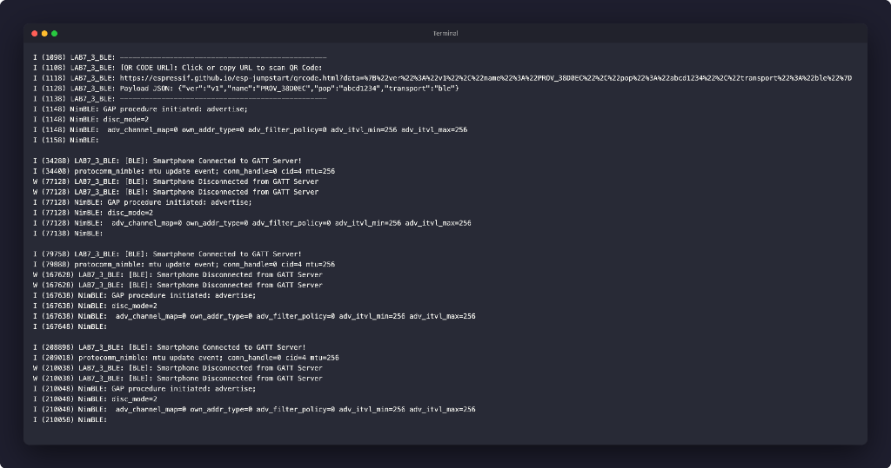
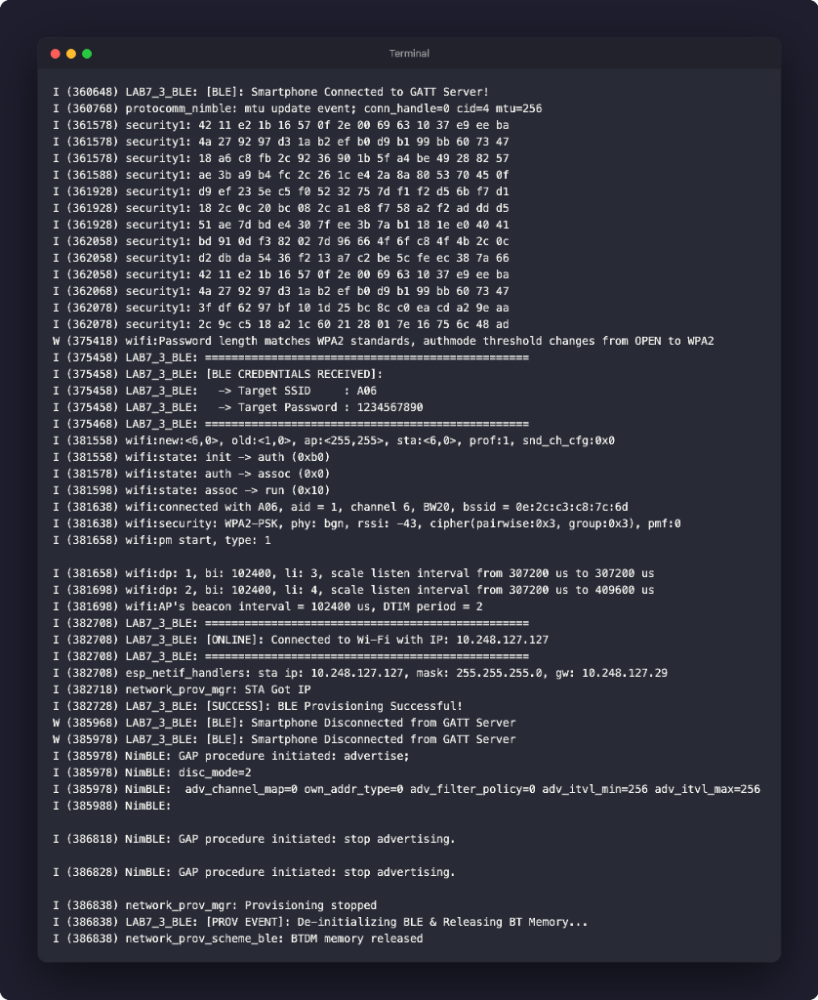
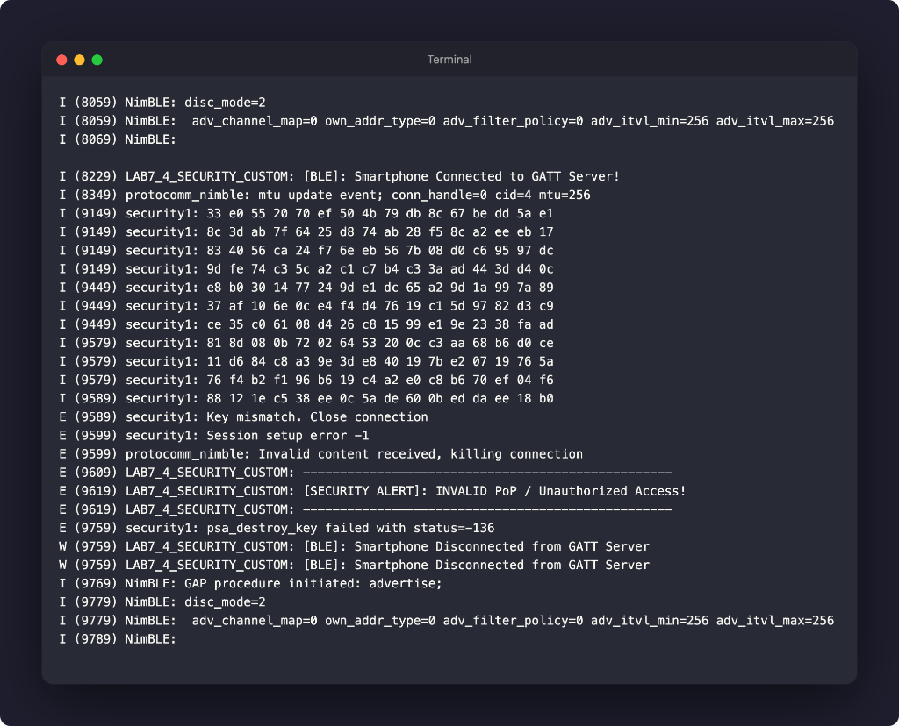
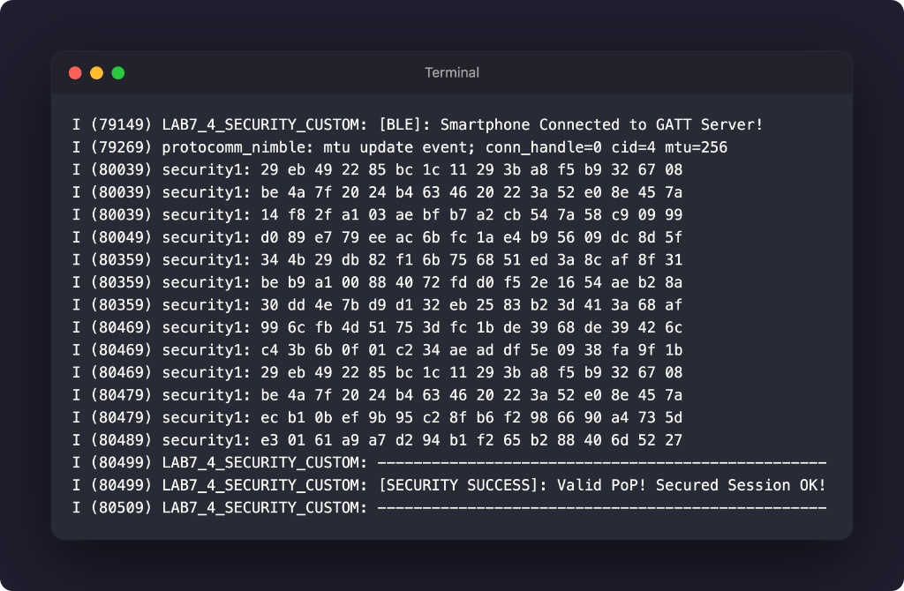
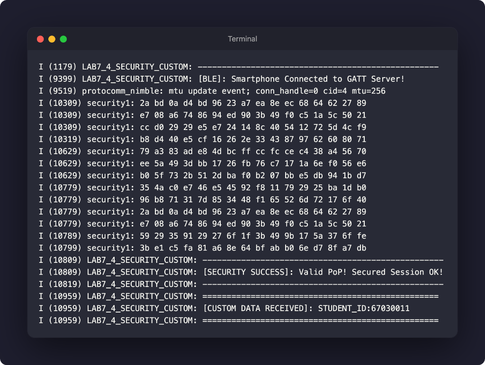

# Week 07: Wi-Fi Provisioning Architecture, Security Schemes and Memory Forensics

## 1. บทนำ (Introduction)
ในสัปดาห์ที่ 7 นี้ เราจะก้าวเข้าสู่กระบวนการที่สำคัญที่สุดกระบวนการหนึ่งของอุปกรณ์ Commercial IoT นั่นคือ "Wi-Fi Provisioning" (กระบวนการส่งมอบสิทธิ์และการตั้งค่าเครือข่ายไร้สายให้อุปกรณ์ใหม่)

ในการพัฒนาอุปกรณ์ IoT สู่เชิงพาณิชย์ อุปกรณ์จะไม่มีหน้าจอหรือคีย์บอร์ดให้ผู้ใช้พิมพ์รหัสผ่าน Wi-Fi เราจึงจำเป็นต้องใช้กลไกการส่งผ่านข้อมูลการเชื่อมต่อ (SSID, Password, Security Keys) จากสมาร์ตโฟนไปยัง ESP32 ผ่านช่องทางสื่อสารชั่วคราว เช่น SoftAP หรือ Bluetooth Low Energy (BLE) ภายใต้กรอบการรักษาความปลอดภัยขั้นสูง (Cryptographic Security Schemes)

นอกจากนี้ เราจะทำการทดลองเชิง Forensic Analysis and Memory Inspection เพื่อสืบสวนและตรวจสอบการจัดเก็บข้อมูล Credentials ใน NVS (Non-Volatile Storage Flash) รวมถึงกลไกการล้างค่าคอนฟิก (Factory Reset) ทั้ง 3 รูปแบบ เพื่อทำความเข้าใจความปลอดภัยและความเสี่ยงของอุปกรณ์ IoT ในระดับ Hardware และ Firmware

---

## 2. แผนผังเนื้อหาการเรียนรู้ประจำสัปดาห์ (Lesson Roadmap)

---

## 3. รายการเอกสารบทเรียน (Lesson Materials)

1. **[01-WiFi-Provisioning-Architecture-and-Protocomm.md](01-WiFi-Provisioning-Architecture-and-Protocomm.md)** - สถาปัตยกรรม Provisioning Manager, Protocomm Layer, Data Serialization (Protobuf) และ State Machine Lifecycle
2. **[02-Transport-Comparison-SoftAP-vs-BLE.md](02-Transport-Comparison-SoftAP-vs-BLE.md)** - เปรียบเทียบ SoftAP (HTTP Server Endpoints) vs BLE (GATT Services, UUIDs, Characteristics)
3. **[03-Provisioning-Security-and-Cryptography.md](03-Provisioning-Security-and-Cryptography.md)** - วิเคราะห์ระดับความปลอดภัย Sec0 (Plaintext), Sec1 (X25519 + AES-CTR + Proof-of-Possession), Sec2 (SRP6a + AES-GCM + Salt/Verifier)
4. **[04-Flash-Memory-and-NVS-Forensics.md](04-Flash-Memory-and-NVS-Forensics.md)** - โครงสร้าง Partition Table, NVS Flash (Offset 0x9000), Key-Value Storage Forensics และการกู้คืน/ตรวจสอบข้อมูล
5. **[05-Glossary.md](05-Glossary.md)** - อภิธานศัพท์และคำย่อทางเทคนิคประจำสัปดาห์ที่ 7

---

## 4. รายการใบงานปฏิบัติการประจำสัปดาห์ (Labsheets)

1. **[06-Labsheet-07-1-Reset-Mechanisms-and-NVS-Forensics.md](06-Labsheet-07-1-Reset-Mechanisms-and-NVS-Forensics.md)** - ใบงานที่ 7.1 ศึกษากลไกการ Reset Provisioning State ทั้ง 3 รูปแบบ (CLI Flash Erase, Menuconfig Build Flag, และ Hardware Pushbutton GPIO 18/21 Factory Reset)
2. **[07-Labsheet-07-2-SoftAP-Provisioning-and-HTTP-Sniffing.md](07-Labsheet-07-2-SoftAP-Provisioning-and-HTTP-Sniffing.md)** - ใบงานที่ 7.2 การตั้งค่า Wi-Fi ผ่าน SoftAP Scheme, การสแกน QR Code และการวิเคราะห์ Protocomm Endpoints
3. **[08-Labsheet-07-3-BLE-Provisioning-and-GATT-Forensics.md](08-Labsheet-07-3-BLE-Provisioning-and-GATT-Forensics.md)** - ใบงานที่ 7.3 การตั้งค่า Wi-Fi ผ่าน BLE Scheme, การสแกนดู GATT Services/UUIDs ด้วยแอป nRF Connect และแอป ESP BLE Provisioning
4. **[09-Labsheet-07-4-Security-Schemes-and-Custom-Data.md](09-Labsheet-07-4-Security-Schemes-and-Custom-Data.md)** - ใบงานที่ 7.4 การเปรียบเทียบ Security Schemes (Sec0 vs Sec1 PoP), การทดสอบ Invalid PoP และการรับส่ง Custom Data Payload ผ่าน Callback

---

## 5. การต่อวงจรฮาร์ดแวร์ (Hardware Setup)

| อุปกรณ์ / ขา GPIO | ฟังก์ชันการทำงาน | รูปแบบจังหวะการกระพริบ (Blink Pattern) | ความหมายของสถานะ |
| :--- | :--- | :--- | :--- |
| **LED 1 (GPIO 2)** | Wi-Fi Station Status | Heartbeat: ติด 200ms / ดับ 800ms (ทุก 1 วินาที) | Provisioned แล้ว และเชื่อมต่อ Wi-Fi สำเร็จ (Online) |
| | | Blink: ติด 200ms / ดับ 200ms | Provisioned แล้ว แต่ต่อ Wi-Fi ไม่ติด (Disconnecting) |
| **LED 2 (GPIO 4)** | BLE Provisioning | Slow Blink: ติด 500ms / ดับ 500ms | กำลังกระจายสัญญาณ BLE รอการเชื่อมต่อ (Advertising) |
| | | Fast Blink: ติด 100ms / ดับ 100ms | มี Client ต่อ BLE เข้ามา และกำลังรับส่ง Credentials |
| | | ดับสนิท (OFF) | ไม่อยู่ในโหมด BLE Provisioning |
| **LED 3 (GPIO 5)** | SoftAP Provisioning | Slow Blink: ติด 500ms / ดับ 500ms | กำลังปล่อย Wi-Fi SoftAP รอการเชื่อมต่อ (Listening) |
| | | Fast Blink: ติด 100ms / ดับ 100ms | มี Client ต่อ SoftAP และกำลังรับส่งข้อมูลผ่าน HTTP |
| | | ดับสนิท (OFF) | ไม่อยู่ในโหมด SoftAP Provisioning |
| **Button (GPIO 18/21)** | Factory Reset Button | กดค้างไว้ 3 วินาที (Active Low ต่อลง GND) | สั่งล้าง NVS Flash และกลับสู่โหมด Provisioning |

---

## 6. สรุปผลการทดลองและคำตอบคำถามท้ายการทดลอง (Lab Results and Answers)

---

### ใบงานที่ 7.1: การศึกษากลไก Reset Provisioning 3 รูปแบบ และ NVS Memory Forensics

#### ภาพหลักฐานผลการทดลอง:
1. การล้าง Flash ผ่าน CLI (`idf.py erase-flash`):

2. การสั่ง Reset ผ่าน Menuconfig (`CONFIG_EXAMPLE_RESET_PROVISIONED=y`):

3. การกดปุ่ม Hardware Factory Reset บน GPIO 21 ค้าง 3 วินาที:

#### ตารางบันทึกผลการทดลอง:
| รูปแบบการ Reset | คำสั่ง / พฤติกรรมที่ทำ | พฤติกรรมของ LED แต่ละดวงหลังเปิดเครื่อง | สถานะใน Serial Monitor |
| :--- | :--- | :--- | :--- |
| **1. CLI Erase** | `idf.py erase-flash` | LED 1 ดับสนิท (ไม่อยู่ในโหมด STA) | `[STATUS]: Device is NOT provisioned (NVS is empty)` และรอการทำ Provisioning ใหม่ |
| **2. Menuconfig Flag** | `CONFIG_EXAMPLE_RESET_PROVISIONED=y` | LED 1 ดับสนิท | แสดง Log บังคับรีเซ็ต State Machine และเข้าสู่สถานะ Not Provisioned ทุกครั้งที่บูตเครื่อง |
| **3. Hardware Button (GPIO 18/21)** | กดปุ่ม GPIO 18/21 ค้าง 3 วินาที | ขณะกดค้าง LED 1 ดับ / หลังรีเซ็ตเข้าสู่สถานะ Unprovisioned | Log นับเวลา `Holding button... 1/3... 2/3... 3/3` -> `>>> FACTORY RESET TRIGGERED! ERASING NVS FLASH <<<` -> `Device is NOT provisioned` |

#### คำถามท้ายการทดลองและคำตอบ:
1. **เหตุใดการใช้คำสั่ง `idf.py erase-flash` จึงทำให้ ESP32 กลับเข้าสู่ Provisioning Mode เสมอ?**
   * **คำตอบ:** คำสั่ง `idf.py erase-flash` สั่งลบข้อมูลทั้งหมดใน Flash Memory ของชิป ESP32 ให้กลับเป็นค่า `0xFF` รวมไปถึง NVS Partition (Offset `0x9000`) ส่งผลให้ Wi-Fi Credentials หายไป เมื่อฟังก์ชัน `wifi_prov_mgr_is_provisioned()` ทำการตรวจสอบค่าจาก NVS จะได้ค่า `provisioned = false` บอร์ดจึงเข้าสู่โหมด Provisioning เสมอ
2. **ในการผลิตอุปกรณ์จริงเพื่อจำหน่ายให้ผู้บริโภคทั่วไป วิธีการ Reset รูปแบบใดมีความเหมาะสมที่สุด เพราะเหตุใด?**
   * **คำตอบ:** **Consumer Hardware Reset (ปุ่มกดภายนอก)** เหมาะสมที่สุด เพราะผู้บริโภคทั่วไปไม่สามารถเข้าถึงพอร์ต Serial หรือมีความรู้ในการพิมพ์คำสั่ง CLI ได้ การมีปุ่ม Factory Reset ทางกายภาพช่วยให้ผู้ใช้งานสามารถกู้คืนอุปกรณ์และเริ่มตั้งค่าใหม่ได้ด้วยตนเอง
3. **เพราะเหตุใดการกดปุ่ม BOOT (GPIO 0) ค้างไว้ขณะเปิดเครื่องจึงไม่ใช่การทำ Factory Reset ของ Firmware แต่กลับทำให้อุปกรณ์หยุดทำงาน?**
   * **คำตอบ:** ขา GPIO 0 เป็น Strapping Pin หากมีสถานะเป็น LOW ขณะ Reset หรือจ่ายไฟ ชิปจะเข้าสู่ ROM Download Bootloader Mode เพื่อรอรับการแฟลชโปรแกรมใหม่ ทำให้ระบบไม่รันโค้ด `app_main()`
4. **หากต้องการให้โปรแกรมทำการ Factory Reset โดยลบเฉพาะข้อมูล Wi-Fi Provisioning แต่ยังคงเก็บข้อมูล User Setting อื่นๆ ไว้ใน NVS จะต้องแก้โค้ดจาก `nvs_flash_erase()` เป็นคำสั่งใด?**
   * **คำตอบ:** ต้องเปลี่ยนมาใช้คำสั่ง `nvs_erase_key()` หรือ `nvs_erase_all()` เฉพาะ Namespace `nvs.net80211` หรือเรียกใช้ฟังก์ชัน `wifi_prov_mgr_reset_provisioning()` แทนการล้างทั้ง Flash

---

### ใบงานที่ 7.2: การคอนฟิก Wi-Fi ผ่าน SoftAP Scheme และการวิเคราะห์ Protocomm Endpoints

#### ภาพหลักฐานผลการทดลอง:
* บันทึก Log การทำงานครบวงจรตั้งแต่ SoftAP เริ่มต้น, Mobile เชื่อมต่อ, ได้รับ Credentials, เชื่อมต่อ Router และได้รับ IP Address `10.248.127.127`:

#### ตารางบันทึกผลการทดลอง:
| รายการตรวจสอบ | ค่าที่บันทึกได้จากการทดลอง |
| :--- | :--- |
| **1. ชื่อ SoftAP SSID ของ ESP32** | `PROV_38D0EC` |
| **2. รหัส PoP (Proof of Possession)** | `abcd1234` |
| **3. ข้อความใน QR Code Payload (JSON)** | `{"ver":"v1","name":"PROV_38D0EC","pop":"abcd1234","transport":"softap"}` |
| **4. พฤติกรรมไฟ LED 3 (GPIO 5)** | ช่วงรอ: กระพริบช้า (500ms) / ช่วงรับส่งข้อมูล: กระพริบเร็ว (100ms) / หลังสำเร็จ: ดับสนิท |
| **5. IP Address ที่ ESP32 ได้รับจาก Router** | `10.248.127.127` (Gateway: `10.248.127.29`) |
| **6. เวลาที่ใช้ในการทำ Provisioning** | ประมาณ 2.5 - 3.5 วินาที |

#### คำถามท้ายการทดลองและคำตอบ:
1. **ในโหมด SoftAP Scheme สมาร์ตโฟนส่งข้อมูลหา ESP32 ผ่านโปรโตคอลและ IP Address ใด?**
   * **คำตอบ:** ส่งผ่านโปรโตคอล HTTP REST (HTTP POST Request) ไปยัง IP Address `192.168.4.1` (พอร์ต 80) ผ่าน Endpoint ต่างๆ เช่น `/prov-session`, `/prov-scan`, และ `/prov-config`
2. **หากผู้ใช้ป้อนรหัสผ่าน Wi-Fi ผิดในแอปมือถือ จะเกิด Event ใดขึ้นบน ESP32 และ ESP32 มีพฤติกรรมอย่างไร?**
   * **คำตอบ:** เกิด Event `NETWORK_PROV_WIFI_CRED_FAIL` และ `WIFI_EVENT_STA_DISCONNECTED` โดย ESP32 จะยังไม่ปิด SoftAP แต่จะส่งสถานะ Error Response กลับไปยังแอปบนมือถือ เพื่อให้ผู้ใช้กรอกรหัสผ่านใหม่ได้ทันที
3. **ทำไมผู้ผลิต IoT ส่วนใหญ่จึงมองว่ากระบวนการเชื่อมต่อแบบ SoftAP มีขั้นตอนที่ยุ่งยากสำหรับผู้ใช้ทั่วไปเมื่อเทียบกับ BLE?**
   * **คำตอบ:** เพราะผู้ใช้ต้องสลับเครือข่าย Wi-Fi บนมือถือด้วยตนเอง (Manual Wi-Fi Switching) และอาจเจอปัญหา OS ตัดสัญญาณกลับไปใช้ Cellular Data เนื่องจากเครือข่าย SoftAP ไม่มีอินเทอร์เน็ต ขณะที่ BLE ทำงานได้ทันทีโดยไม่กระทบการใช้งานอินเทอร์เน็ตของโทรศัพท์

---

### ใบงานที่ 7.3: การคอนฟิก Wi-Fi ผ่าน BLE Scheme และการสืบสวน GATT Services

#### ภาพหลักฐานผลการทดลอง:
1. การเชื่อมต่อ BLE GATT Server และการเจรจา MTU Size:

2. การทำ BLE Provisioning สำเร็จและการคืนหน่วยความจำ Bluetooth Controller (`BTDM memory released`):

#### ตารางบันทึกผลการทดลอง:
| รายการตรวจสอบ | ผลการทดลอง / ข้อมูลที่สังเกตได้ |
| :--- | :--- |
| **1. BLE Device Name ที่สแกนเจอ** | `PROV_38D0EC` (Bluetooth MAC: `84:1f:e8:38:d0:ee`) |
| **2. Primary Service UUID (128-bit)** | `021a9004-0382-4aea-bff4-6b3f1c5adfb4` |
| **3. Characteristic Endpoints ที่พบ (Descriptor 0x2901)** | 1. `021aff4f-...` -> `prov-ctrl` 2. `021aff50-...` -> `prov-scan` 3. `021aff51-...` -> `prov-session` 4. `021aff52-...` -> `prov-config` 5. `021aff53-...` -> `proto-ver` |
| **4. พฤติกรรมไฟ LED 2 (GPIO 4)** | ช่วงรอ Advertising: กระพริบช้า (500ms) / ช่วงต่อ BLE: กระพริบเร็ว (100ms) / หลังสำเร็จ: ดับสนิท |
| **5. การคืนหน่วยความจำ Bluetooth** | ปรากฏข้อความ `network_prov_scheme_ble: BTDM memory released` เพื่อคืนหน่วยความจำสู่ระบบ DRAM |

#### คำถามท้ายการทดลองและคำตอบ:
1. **เหตุใด BLE Provisioning จึงไม่ส่งผลให้สัญญาณ Wi-Fi บนสมาร์ตโฟนของผู้ใช้หลุดระหว่างทำรายการ?**
   * **คำตอบ:** เพราะ BLE ทำงานบนคนละคลื่นความถี่และโปรโตคอลสแต็กแยกต่างหากจาก Wi-Fi Interface ของสมาร์ตโฟน โทรศัพท์จึงสื่อสารกับ ESP32 ได้โดยตรงโดยที่ Wi-Fi และ Cellular Data ยังคงเชื่อมต่ออินเทอร์เน็ตได้ตามปกติ
2. **Descriptor `0x2901` มีความสำคัญอย่างไรต่อการที่แอปพลิเคชันมือถือจะทราบว่า Characteristic แต่ละตัวใช้ทำหน้าที่อะไร?**
   * **คำตอบ:** Descriptor `0x2901` (Characteristic User Description) ทำหน้าที่เป็น Human-readable String ระบุชื่อ Protocomm Endpoint เช่น `prov-session` หรือ `prov-config` เพื่อให้แอปพลิเคชันมือถือทราบหน้าที่ของแต่ละท่อได้อย่างถูกต้อง
3. **การที่ ESP-IDF มีฟังก์ชัน `esp_bt_mem_release()` มีประโยชน์อย่างไรต่อการทำงานของแอปพลิเคชัน IoT หลังเชื่อมต่อ Wi-Fi สำเร็จ?**
   * **คำตอบ:** เป็นการคืนหน่วยความจำ RAM ของ Bluetooth Controller ประมาณ 80 - 100 KB กลับเข้าสู่ FreeRTOS Heap DRAM ทำให้แอปพลิเคชันมีแรมเหลือสำหรับรันงานหลัก เช่น MQTT, TLS/SSL Buffer และ Web Server ได้อย่างเสถียร

---

### ใบงานที่ 7.4: การทดสอบ Security Schemes (PoP) และการรับส่ง Custom Data Endpoints

#### ภาพหลักฐานผลการทดลอง:
1. การทดสอบป้อน PoP ไม่ถูกต้อง (`[SECURITY ALERT]: INVALID PoP / Unauthorized Access!`):

2. การทดสอบป้อน PoP ถูกต้อง (`[SECURITY SUCCESS]: Valid PoP! Secured Session OK!`):

3. การรับส่งข้อมูล Custom Data รหัสนักศึกษา `STUDENT_ID:67030011` ผ่าน Endpoint `custom-data`:

#### ตารางบันทึกผลการทดลอง:
| สถานการณ์ทดสอบ | ค่า PoP ที่ป้อน | ผลลัพธ์บนแอปมือถือ / สคริปต์ | ข้อความ Log ใน Serial Monitor |
| :--- | :--- | :--- | :--- |
| **1. ป้อน PoP ผิดพลาด** | `wrong1234` | แสดง Session establishment failed / Invalid PoP และตัดการเชื่อมต่อ | `E security1: Key mismatch. Close connection` `E [SECURITY ALERT]: INVALID PoP / Unauthorized Access!` `W [BLE]: Smartphone Disconnected from GATT Server` |
| **2. ป้อน PoP ถูกต้อง** | `abcd1234` | ผ่านขั้นตอนตรวจสอบสิทธิ์สำเร็จ ได้รับ AES Session Key | `I [SECURITY SUCCESS]: Valid PoP! Secured Session OK!` `I [BLE CREDENTIALS RECEIVED]: SSID: A06` `I [SUCCESS]: Provisioning Completed Successfully!` |
| **3. ส่ง Custom Data** | `STUDENT_ID:67030011` | ได้รับข้อความตอบกลับ: `ACK_FROM_ESP32_SUCCESS` | `I [CUSTOM DATA RECEIVED]: STUDENT_ID:67030011` ESP32 จัดสรรคำตอบกลับบน Heap และส่งกลับไปยัง Client |

#### คำถามท้ายการทดลองและคำตอบ:
1. **การใช้ Proof-of-Possession (PoP) ช่วยป้องกันการโจมตีประเภทใดได้บ้าง?**
   * **คำตอบ:** ป้องกันการโจมตีประเภท Rogue Provisioning (การสวมรอยหรือยึดครองอุปกรณ์โดยบุคคลที่ไม่ได้รับอนุญาต) และ Man-in-the-Middle (MitM) Attack เพราะหากไม่มีรหัส PoP ผู้โจมตีจะไม่สามารถผ่านขั้นตอน Cryptographic Handshake ได้
2. **หากไม่มีการใช้ PoP (เช่น ใน Security 0) ผู้โจมตีที่อยู่ในรัศมีสัญญาณบลูทูธสามารถทำสิ่งใดกับอุปกรณ์ได้บ้าง?**
   * **คำตอบ:** ผู้โจมตีสามารถเชื่อมต่อเข้ามาส่ง Wi-Fi Credentials ปลอมเพื่อหลอกให้อุปกรณ์ไปเกาะ Rogue AP, ดักฟังข้อมูลการตั้งค่า Plain-text และยึดการควบคุมอุปกรณ์ได้โดยตรง
3. **ในการประยุกต์ใช้งานเชิงพาณิชย์จริง เราสามารถนำ Custom Data Endpoint ไปใช้ส่งข้อมูลประเภทใดได้อีกบ้าง (ยกตัวอย่าง 2 กรณี)?**
   * **คำตอบ:**
     * กรณีที่ 1 (User Account Binding): ส่ง User Token หรือ Account UUID จากแอปมือถือเพื่อทำการผูกอุปกรณ์เข้ากับบัญชีผู้ใช้บน Cloud Platform ทันที
     * กรณีที่ 2 (Server & MQTT Broker Config): ส่ง URL ของ MQTT Broker Address, Tenant ID หรือ API Key เพื่อกำหนดเซิร์ฟเวอร์ปลายทางขององค์กร
4. **ในฟังก์ชัน `custom_prov_data_handler()` เหตุใดหน่วยความจำที่จัดสรรให้ `*outbuf` จึงถูก Free โดย Protocomm Layer อัตโนมัติหลังจากส่งข้อมูลเสร็จ?**
   * **คำตอบ:** เพื่อป้องกันปัญหา Memory Leak เนื่องจาก Handler ทำหน้าที่เพียงจัดสรรพอยน์เตอร์ข้อมูลบน Heap ส่วน Protocomm Layer จะเป็นผู้นำข้อมูลไปเข้ารหัสและส่งผ่าน BLE/HTTP แบบ Asynchronous เมื่อส่งเสร็จสมบูรณ์ Protocomm จึงรับผิดชอบสั่ง `free(*outbuf)` คืน DRAM ให้ระบบโดยอัตโนมัติ

---

## 7. อ้างอิง (References)
* [ESP-IDF Unified Provisioning](https://docs.espressif.com/projects/esp-idf/en/stable/esp32/api-reference/provisioning/provisioning.html#unified-provisioning)
* ESP-IDF Provisioning Android: [esp-idf-provisioning-android](https://github.com/espressif/esp-idf-provisioning-android)
* ESP-IDF Provisioning iOS: [esp-idf-provisioning-ios](https://github.com/espressif/esp-idf-provisioning-ios)

---
ปรับปรุงล่าสุด: สิงหาคม 2569
